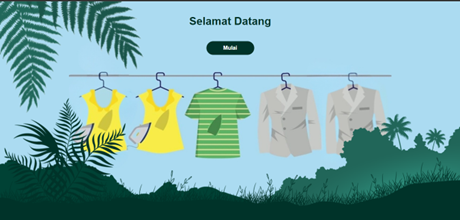
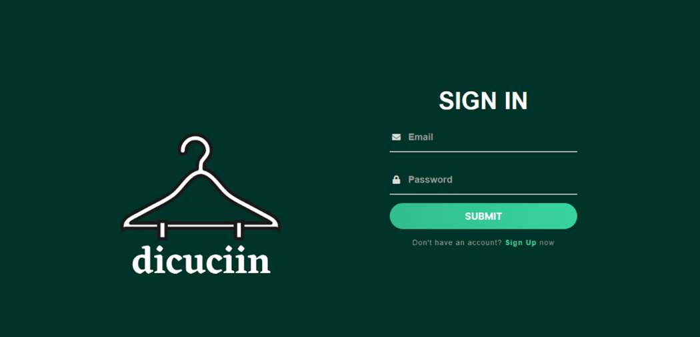
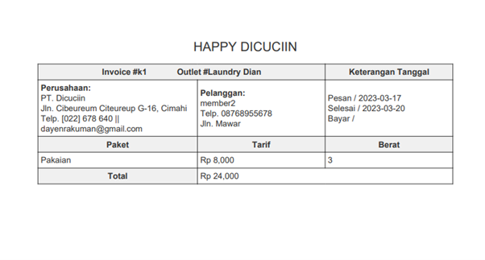
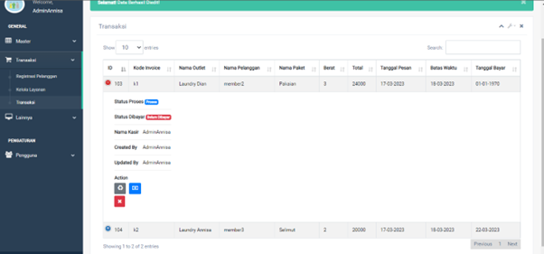
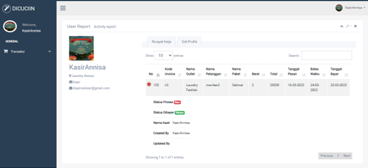
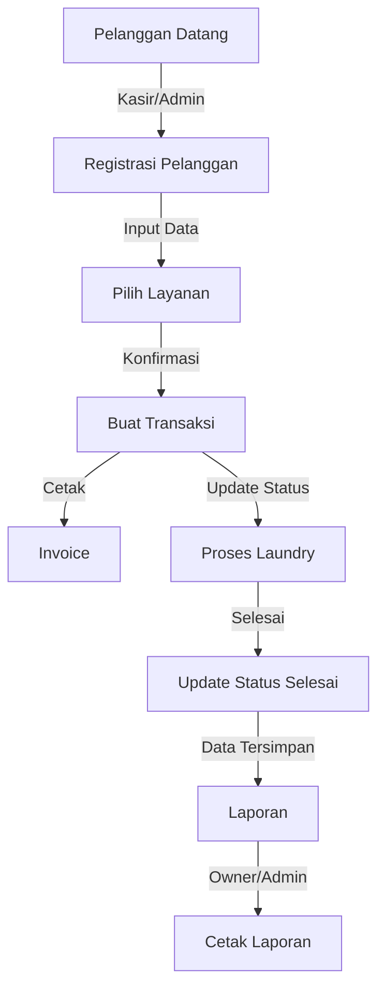

<h1 align="center">Laundry Management System</h1>
<p align="center">
  <b>Sistem manajemen laundry berbasis web untuk pengelolaan outlet, transaksi, dan laporan</b>
</p>

<p align="center">
  
  
  
  
  
</p>

## 📋 Deskripsi

Aplikasi Laundry adalah sistem manajemen berbasis web yang dikembangkan untuk mengoptimalkan proses bisnis laundry, mulai dari pendaftaran pelanggan, pengelolaan transaksi, hingga pelaporan. Aplikasi ini menyediakan tiga role pengguna dengan akses yang berbeda: Admin, Kasir, dan Owner, yang dirancang untuk meningkatkan efisiensi operasional dan meningkatkan pelayanan pelanggan.

## 🚀 Demo Aplikasi

### Tampilan Login dengan Efek Parallax
Aplikasi menggunakan efek parallax pada halaman login untuk memberikan pengalaman visual yang menarik bagi pengguna.
<p align="center">
  
</p>
<p align="center">
  
</p>

## ✨ Fitur Utama

### 1. Pengelolaan Outlet
Admin dapat mengelola informasi outlet lengkap dengan alamat dan detail kontak.
<p align="center">
  
</p>

### 2. Manajemen Paket Layanan
Pengaturan berbagai paket layanan laundry dengan harga dan jenis yang berbeda.
<p align="center">
  
</p>

### 3. Registrasi Pelanggan
Pendaftaran pelanggan baru dengan data lengkap untuk memudahkan transaksi berikutnya.
<p align="center">
  
</p>

### 4. Transaksi & Invoice
Pembuatan transaksi lengkap dengan cetak invoice sebagai bukti pembayaran yang sah.
<p align="center">
  
</p>
<p align="center">
  
</p>
<p align="center">
  
</p>
<p align="center">
  
</p>

### 5. Laporan Komprehensif
Sistem pelaporan detail untuk membantu Owner memonitor kinerja bisnis.
<p align="center">
  
</p>

### 6. Manajemen Pengguna
Admin dapat mengelola akun pengguna dengan berbagai role (Admin, Kasir, Owner).
<p align="center">
  
</p>

### 7. Profile
Melihat data riwayat kerja dan mengedit profil pengguna.
<p align="center">
  
</p>

## 🌟 Manfaat

- **Efisiensi Operasional:** Mengurangi waktu yang dibutuhkan untuk registrasi pelanggan dan pembuatan transaksi.
- **Tracking Status Laundry:** Memudahkan pelacakan status proses laundry dari awal hingga selesai.
- **Pengelolaan Keuangan:** Membantu Owner melacak pendapatan dan kinerja bisnis melalui laporan yang dapat dicetak.
- **Manajemen Multi-Outlet:** Mendukung pengelolaan beberapa outlet dalam satu sistem terpadu.
- **Cetak Invoice Otomatis:** Menghasilkan bukti transaksi profesional yang dapat langsung dicetak untuk pelanggan.

## 👥 Struktur Pengguna

Aplikasi ini memiliki tiga tipe pengguna dengan hak akses berbeda:

### Admin
- Mengelola data outlet (CRUD dengan soft delete)
- Mengelola data paket (CRUD dengan soft delete)
- Registrasi pelanggan dan membuat transaksi
- Mengelola layanan dan transaksi
- Melihat dan mencetak laporan
- Mengelola data pengguna (CRUD dengan soft delete)
- Mengedit profil pribadi

### Kasir
- Registrasi pelanggan dan membuat transaksi
- Mengelola layanan dan transaksi
- Mengedit profil pribadi

### Owner
- Melihat dan mencetak laporan
- Mengedit profil pribadi

## 📊 Alur Kerja Sistem



## 🛠️ Teknologi yang Digunakan

- **Frontend:** HTML, CSS, JavaScript, Bootstrap, Parallax Effect
- **Backend:** PHP dengan framework Laravel
- **Database:** MySQL
- **Reporting:** DomPDF untuk laporan dan invoice

## 📥 Instalasi dan Penggunaan

### Persyaratan Sistem
- PHP >= 8.0
- Composer
- MySQL

### Langkah Instalasi

1. Clone repositori
```bash
git clone https://github.com/AnnisaDianFadillah06/laundry-management-system.git
cd laundry-management-system
```

2. Instal dependensi
```bash
composer install
```

3. Salin file .env.example menjadi .env dan konfigurasi
```bash
cp .env.example .env
php artisan key:generate
```

4. Konfigurasi database di file .env

5. Migrasi dan isi database
```bash
php artisan migrate --seed
```

6. Jalankan aplikasi
```bash
php artisan serve
```

7. Akses aplikasi melalui browser di http://localhost:8000

## 📚 Detail Menu

### 1. Master (Admin)
- **Menu Data Outlet:** Mengelola data outlet dengan fitur CRUD dan soft delete.
- **Menu Data Paket:** Mengelola data paket layanan dengan fitur CRUD dan soft delete.

### 2. Transaksi (Admin & Kasir)
- **Menu Registrasi Pelanggan:** Mendaftarkan pelanggan baru sekaligus membuat data transaksi dan cetak invoice.
- **Menu Kelola Layanan:** Menampilkan data pelanggan dan pembuatan transaksi disertai cetak invoice.
- **Menu Transaksi:** Memperbarui status proses dan pembayaran serta menghapus permanen data transaksi.

### 3. Lainnya (Admin & Owner)
- **Menu Laporan:** Mencetak data transaksi berdasarkan periode atau kriteria tertentu.

### 4. Pengguna (Admin)
- **Menu Data Pengguna:** Mengelola data pengguna sistem dengan fitur CRUD dan soft delete.

### 5. Profile (Semua role)
- Melihat data riwayat kerja dan mengedit profil pengguna.

## 📚 Proyek Ini Dikembangkan Oleh
Annisa Dian Fadillah
